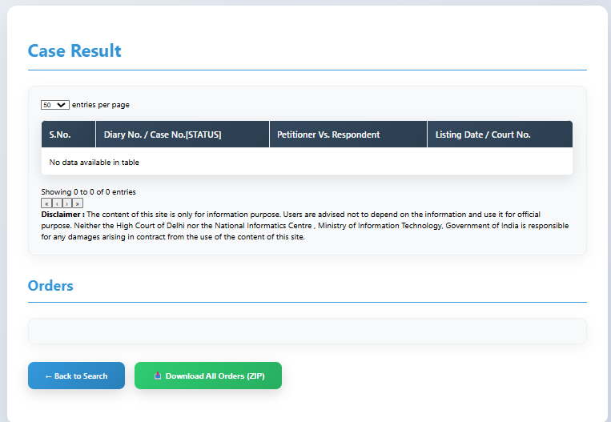

# Court Data Fetcher & Mini-Dashboard

A web application that fetches and displays case metadata and orders/judgments from the Delhi High Court portal.

[](https://github.com/ofsaksham)
[](https://github.com/ofsaksham/Court_Data_Fetcher)

**Repository**: [https://github.com/ofsaksham/Court_Data_Fetcher](https://github.com/ofsaksham/Court_Data_Fetcher)  
**Author**: [@ofsaksham](https://github.com/ofsaksham)

## 🎯 Objective

This application allows users to search for court cases by selecting a Case Type, Case Number, and Filing Year. It then fetches and displays the case metadata along with the latest orders/judgments related to that case.

## 🏛️ Target Court

**Delhi High Court** - https://delhihighcourt.nic.in/

The application targets the Delhi High Court's public portal for case information retrieval.

## ✨ Features

- **Simple Web Interface**: Clean, user-friendly form for case search
- **Case Information Display**: Shows parties' names, filing dates, and next hearing dates
- **Order/Judgment Access**: Displays and allows downloading of case orders and judgments
- **Data Logging**: Stores all queries and responses in SQLite database
- **Error Handling**: User-friendly error messages for invalid cases or site downtime
- **CAPTCHA Handling**: Automated CAPTCHA solving with refresh and audio options

## 🛠️ Technology Stack

- **Backend**: Python with Flask
- **Frontend**: HTML, CSS, JavaScript
- **Database**: SQLite
- **Web Scraping**: Selenium WebDriver
- **Browser Automation**: Chrome WebDriver
- **Styling**: Custom CSS with modern gradients and animations

## 📋 Functional Requirements

### 1. User Interface
- Simple form with dropdowns/inputs for:
  - Case Type (dropdown)
  - Case Number (text input)
  - Filing Year (dropdown)
- CAPTCHA display with refresh and audio options
- Responsive design with modern styling

### 2. Backend Functionality
- Programmatic data fetching from Delhi High Court portal
- CAPTCHA bypass using automated solving
- Data parsing and extraction of:
  - Parties' names
  - Filing & next-hearing dates
  - Order/judgment PDF links
- SQLite database logging for all queries and responses

### 3. Data Display
- Clean presentation of parsed case details
- Download functionality for linked PDFs
- Modal view for orders and judgments
- Progress indicators for downloads

### 4. Error Handling
- User-friendly error messages
- Graceful handling of invalid case numbers
- Site downtime detection and reporting

## 📚 Documentation

- [API Documentation](docs/API.md) - Detailed API endpoints, request/response formats, and usage examples
- [Deployment Guide](docs/DEPLOYMENT.md) - Comprehensive deployment instructions for local and production environments

## 🚀 Setup Instructions

### Prerequisites
- Python 3.8 or higher
- Chrome browser installed
- ChromeDriver (automatically managed by webdriver-manager)

**Note**: This project has been simplified to run directly without Docker for easier setup and development.

### Environment Variables (Optional)
The application can be configured using environment variables:

```bash
# Optional: Configure database path
export DATABASE_PATH=./case_data.db

# Optional: Configure Flask settings
export FLASK_ENV=development
export FLASK_DEBUG=1

# Optional: Configure Selenium settings
export SELENIUM_TIMEOUT=30
export SELENIUM_RETRY_ATTEMPTS=3
```

### Installation

1. **Clone the repository**
   ```bash
   git clone https://github.com/ofsaksham/Court_Data_Fetcher.git
   cd Court_Data_Fetcher
   ```

2. **Install dependencies**
   ```bash
   pip install -r requirements.txt
   ```

3. **Run the application**
   ```bash
   python app.py
   ```

4. **Access the application**
   Open your browser and navigate to `http://localhost:5000`

**Simple Setup**: No Docker required - just Python and Chrome!

### 🚀 Quick Start
For immediate testing, try these sample case details:
- **Case Type**: WP (Writ Petition)
- **Case Number**: 1234
- **Filing Year**: 2023

*Note: Use valid case numbers from the Delhi High Court portal for actual results.*

## 📸 Demo Screenshots

### 1. Search Page

*Main search interface with case type, case number, filing year, and CAPTCHA*

### 2. Case Result

*Successful case search showing case details, parties, and downloadable orders*

### 3. No Case Found

*Error handling when case is not found in the system*

## 🎥 Demo Video

[Watch Demo Video on Google Drive](https://drive.google.com/file/d/1XmEZqCKYE9QOp2Wfa8H3P8QtLMSWmKKG/view?usp=sharing)
*5-minute screen capture showing end-to-end application flow*

**Demo Highlights:**
- Application setup and installation
- Case search with CAPTCHA handling  
- Results display and PDF downloads
- Error handling demonstration

*Note: Video demonstrates complete workflow from installation to successful case retrieval*

## 🧩 CAPTCHA Strategy

The application implements a multi-layered CAPTCHA handling strategy:

1. **Automated Solving**: Uses OCR and image processing to solve CAPTCHAs
2. **Manual Refresh**: Users can refresh CAPTCHA if automated solving fails
3. **Audio CAPTCHA**: Provides audio playback of CAPTCHA for accessibility
4. **Retry Mechanism**: Automatic retries with different CAPTCHA attempts
5. **Fallback Options**: Multiple solving approaches to ensure reliability

### CAPTCHA Bypass Methods:
- **Image Recognition**: OCR-based text extraction
- **Audio Processing**: Speech-to-text for audio CAPTCHAs
- **Manual Intervention**: User can manually enter CAPTCHA if needed
- **Session Management**: Maintains browser sessions to reduce CAPTCHA frequency

## 📊 Database Schema

The application uses SQLite with the following structure:

```sql
-- Case queries table
CREATE TABLE case_queries (
    id INTEGER PRIMARY KEY AUTOINCREMENT,
    case_type TEXT NOT NULL,
    case_number TEXT NOT NULL,
    case_year INTEGER NOT NULL,
    query_timestamp DATETIME DEFAULT CURRENT_TIMESTAMP,
    response_data TEXT,
    status TEXT,
    error_message TEXT
);

-- Case results table
CREATE TABLE case_results (
    id INTEGER PRIMARY KEY AUTOINCREMENT,
    query_id INTEGER,
    parties TEXT,
    filing_date TEXT,
    next_hearing TEXT,
    case_status TEXT,
    orders_data TEXT,
    FOREIGN KEY (query_id) REFERENCES case_queries (id)
);
```

## 🏗️ Project Structure

```
Court_Data_Fetcher/
├── app.py                 # Main Flask application
├── db.py                  # Database operations
├── selenium_worker.py     # Web scraping logic
├── requirements.txt       # Python dependencies
├── case_data.db          # SQLite database
├── templates/
│   ├── index.html        # Main search page
│   └── result.html       # Results display page
└── static/
    └── css/
        ├── index.css     # Index page styles
        └── result.css    # Result page styles
```

## 🔒 Security Considerations

- **Input Validation**: Proper validation of user inputs
- **SQL Injection Prevention**: Parameterized queries
- **XSS Protection**: HTML escaping of user-generated content
- **Rate Limiting**: Built-in delays to prevent overwhelming the target sites

## 🧪 Testing

The application includes basic error handling and validation:

- Input validation for case numbers and years
- Network timeout handling
- CAPTCHA failure recovery
- Database error handling
- User-friendly error messages

## 🚨 Error Handling

The application handles various error scenarios:

- **Invalid Case Numbers**: Clear error messages with suggestions
- **Network Issues**: Timeout handling and retry mechanisms
- **CAPTCHA Failures**: Multiple fallback options
- **Site Downtime**: Graceful degradation with informative messages
- **Database Errors**: Proper error logging and user notification

## 📈 Future Enhancements

- **Pagination**: Support for multiple orders/judgments
- **Cloud Deployment**: Support for various cloud platforms
- **Unit Tests**: Comprehensive test coverage
- **CI/CD Pipeline**: Automated testing and deployment
- **API Endpoints**: RESTful API for programmatic access
- **Caching**: Redis-based caching for improved performance
- **Analytics**: Usage statistics and monitoring

## 📄 License

This project is licensed under the MIT License - see the [LICENSE](LICENSE) file for details.

## 🤝 Contributing

1. Fork the repository
2. Create a feature branch
3. Make your changes
4. Add tests if applicable
5. Submit a pull request

## 📞 Support

For issues and questions:
- Create an issue in the GitHub repository
- Check the documentation for common solutions
- Review the error logs for debugging information

## ⚠️ Legal Notice

This application is designed for educational and research purposes. Users are responsible for complying with the terms of service of the Delhi High Court website and applicable laws. The application respects rate limits and implements proper delays to avoid overwhelming the target server.
